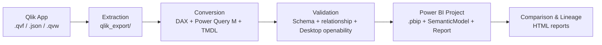

# Qlik to Power BI Migration


Migrate Qlik Sense applications to Power BI `.pbip` projects with one command, while keeping the output structured, validated, and easy to inspect.

## Migration Flow


```mermaid
flowchart LR
  A[Qlik App\n.qvf / .json / .qvw] --> B[Extraction\nqlik_export/]
  B --> C[Conversion\nDAX + Power Query M + TMDL]
  C --> D[Validation\nSchema + relationship + Desktop openability]
  D --> E[Power BI Project\n.pbip + SemanticModel + Report]
  E --> F[Comparison & Lineage\nHTML reports]
```

## At A Glance

- 🧭 Input: `.qvf`, `.json`, or `.qvw` with converted siblings
- 🧱 Output: Power BI `.pbip` projects with Semantic Model and Report folders
- 🔁 Workflow: extraction → conversion → validation → Desktop openability checks
- 🧪 Quality gates: schema validation, DAX checks, M checks, relationship checks, and post-generation validation
- 📚 Parity-friendly docs: clear CLI entry points, report artifacts, and lineage sections

## Why This Project

This repository is designed for repeatable Qlik-to-Power-BI migration work, with a presentation style closer to a polished product README than a raw tool dump.

- ✨ Clear first-run path for new users
- 🛠️ Direct CLI usage for automation and batch migration
- 📈 Report artifacts that make migration quality visible
- 🧩 Lineage, comparison, and validation outputs that support review workflows

## Installation

Create a virtual environment and install the development dependencies:

```bash
python -m venv venv
venv\Scripts\activate
pip install -e ".[dev]"
```

## Quick Start

### 1. Migrate one app

```bash
python migrate.py app.qvf
```

### 2. Migrate a folder

```bash
python migrate.py ./exports
```

### 3. Send output somewhere else

```bash
python migrate.py app.qvf --out ./output
```

Input routing, binary model discovery, many-to-many bridge generation,
validation, repair, and Power BI Desktop openability checks are automatic.

## Core Capabilities

- 🧠 Qlik expressions to DAX conversion
- 🔄 Qlik load script to Power Query M conversion
- 🧱 TMDL semantic model generation
- 🖼️ Visual mapping to PBIR report layout
- 🛡️ Validation, QA, and deployment workflows
- 📉 Comparison and lineage reports for review and cutover

## Output

A successful run generates a Power BI project:

```text
artifacts/powerbi_projects/<AppName>/
  <AppName>.pbip
  <AppName>.SemanticModel/
  <AppName>.Report/
```

Open the `.pbip` directly in Power BI Desktop (Developer Mode).

## Reports And Lineage

- 📊 [comparison_report.html](artifacts/powerbi_projects/comparison_report.html) — side-by-side migration comparison
- 🧬 End-to-end lineage — source field → M → DAX → TMDL → visual
- 🧪 Data preparation lineage — Qlik script flow and Power Query M steps
- 🧰 Desktop openability checks — generated projects are tested against Power BI Desktop behavior

## Documentation

Start with the documentation hub:

- [docs/README.md](docs/README.md)

Most used guides:

- [Quick Start](docs/guides/QUICK_START.md)
- [CLI Reference](docs/guides/CLI_REFERENCE.md)
- [Migration Guide](docs/guides/MIGRATION_GUIDE.md)
- [Deployment Guide](docs/guides/DEPLOYMENT_GUIDE.md)
- [FAQ](docs/FAQ.md)

Useful lineage and validation references:

- [Data Preparation Lineage](docs/DATA_PREP_LINEAGE.md)
- [Data Prep Lineage Guide](docs/DATA_PREP_LINEAGE_GUIDE.md)
- [Tableau parity roadmap](docs/reports/TABLEAU_PARITY_SYNC_ROADMAP_2026-06-24.md)

## Testing

The repository includes more than 2,000 automated tests covering extraction,
conversion, generation, validation, and Power BI Desktop openability.

```bash
# Run tests
python -m pytest tests/ -q

# Focused CLI tests
python -m pytest tests/test_new_cli_flags.py tests/test_simple_mode.py -q
```

## Project Shape

- `migrate.py` — main migration CLI
- `qlik_export/` — extraction and conversion layer
- `powerbi_import/` — Power BI generation and validation layer
- `artifacts/` — generated projects, reports, and run outputs
- `docs/` — guides, parity notes, and roadmap material

## License

MIT
