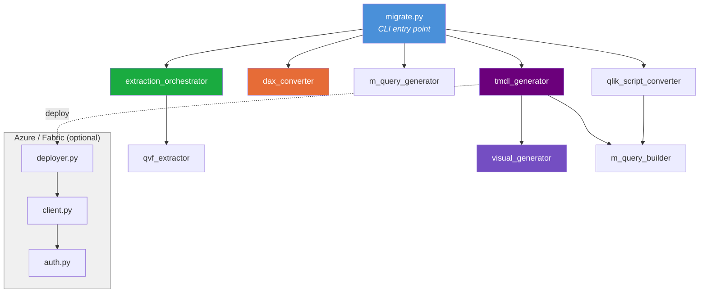
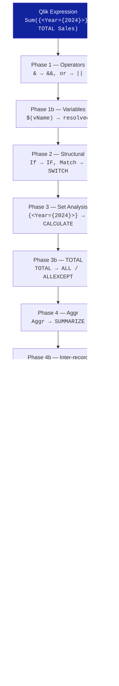
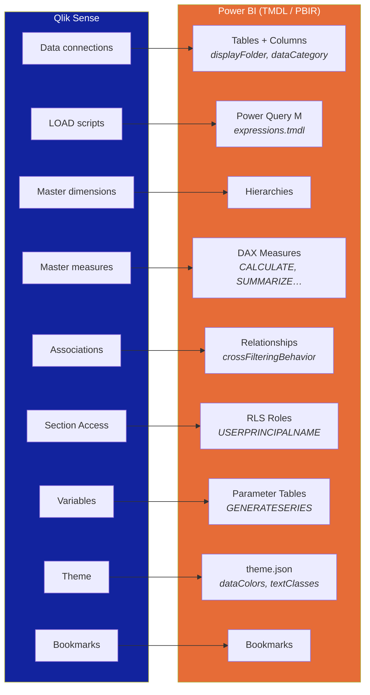

<div align="center">


# Qlik to Power BI Migration

Migrate your Qlik Sense applications to Power BI in seconds — fully automated, zero
manual rework.


[Quick Start](#-quick-start) • [Features](#-key-features) • [How It Works](#-how-it-works) • [DAX Mappings](#-dax-conversions-175-functions) • [Deployment](#-deployment) • [Multi-Agent](#-multi-agent-architecture) • [Docs](#-documentation)

</div>

## ⚡ Quick Start

```bash
# That's it. One command.
python migrate.py your_app.qvf
```

> **Tip:** The output is a `.pbip` project — just double-click to open in Power BI Desktop (Developer Mode).

<details>
<summary>📦 <b>Installation</b></summary>

```bash
python -m venv venv && venv\Scripts\activate
pip install -e ".[dev]"          # core + test deps
# pip install -e ".[all]"       # adds azure-identity for Fabric deployment
```

Or from `requirements.txt`:

```bash
pip install -r requirements.txt
```

</details>

### More ways to migrate

```bash
# 📄 From a JSON export
python migrate.py "export.json" --output-dir output/my_project

# 🔄 Two-step workflow (reuse extracted JSON)
python migrate.py "MonApp.qvf" --output-dir output/step1
python migrate.py "MonApp.qvf" --output-dir output/step1 --skip-extraction

# 🔍 Pre-migration readiness check
python migrate.py "MonApp.qvf" --assess

# 📊 Generate comparison report with data prep lineage
python migrate.py "MonApp.qvf" --compare --data-prep-lineage

# 🚫 Generate comparison report without data prep lineage
python migrate.py "MonApp.qvf" --compare --no-data-prep-lineage

# 🚀 Migrate + deploy to Power BI Service in one shot
python migrate.py "MonApp.qvf" --deploy WORKSPACE_ID

# 🧙 Interactive wizard (guided step-by-step)
python migrate.py "MonApp.qvf" --wizard

# 📊 JSON output for CI/CD pipelines
python migrate.py "MonApp.qvf" --json

# 🔌 Load custom plugins
python migrate.py "MonApp.qvf" --plugins my_module.MyPlugin

# 🏃 Dry run — preview without writing files
python migrate.py "MonApp.qvf" --dry-run

# 🏭 Generate Fabric-native artifacts (Lakehouse + Dataflow + Notebook + Pipeline)
python migrate.py "MonApp.qvf" --output-format fabric

# 🔀 Merge multiple apps into a shared semantic model
python migrate.py --merge app1.json app2.json app3.json

# 📁 Recursive batch migration across nested folders
python migrate.py --batch exports/ --batch-recursive --workers 4

# 📊 Portfolio-level server assessment
python migrate.py --assess-server exports/

# 🔗 Shared semantic model (multiple apps → one model)
python migrate.py --shared-model app1.qvf app2.qvf --model-name SharedSales

# ✅ Full QA pipeline (validate → auto-fix → governance → compare)
python migrate.py "MonApp.qvf" --qa

# 📋 Generate lineage map + manifest
python migrate.py "MonApp.qvf" --manifest

# 🤖 LLM-assisted DAX refinement
python migrate.py "MonApp.qvf" --llm-refine --llm-provider openai --llm-model gpt-4

# 📈 Schema drift detection
python migrate.py "MonApp.qvf" --check-drift /path/to/snapshots

# 🌐 Launch web migration wizard
python migrate.py --web-ui --web-port 8501

# ⚡ Parallel batch migration
python migrate.py "MonApp.qvf" --batch exports/ --workers 4

# ⚡ Recursive batch migration across nested folders
python migrate.py --batch exports/ --batch-recursive --workers 4

# 📦 Profile-based multi-app manifest migration
python migrate.py --migration-manifest examples/migration_manifest.example.json

# 🔐 Qlik server TLS/auth diagnostics (no migration run)
python migrate.py --server-url https://qlik.example.com --server-test

# 🌐 Direct server extraction then migration
python migrate.py --server-url https://qlik.example.com --server-app-id abc123

# 📁 Post-processing artifact exports in generated project
# (created automatically during migration when available)
# - security/security_extract.csv
# - images/embedded_images.csv and images/embedded/*
# - power_query/*.pq
```

---

## 🎯 Key Features

| 🔄 **175+ DAX Conversions** | 📊 **75+ Visual Types** |
| :--- | :--- |
| Translates Qlik expressions to DAX: Set Analysis → CALCULATE, Aggr → SUMMARIZE/SUMX iterators, If/Match → IF/SWITCH, inter-record functions → OFFSET/WINDOW/RANKX, dollar-sign expansion `$(=expr)`, cross-table RELATED/LOOKUPVALUE, RLS security. **v9:** AST-based DAX optimizer (IF→SWITCH, COALESCE, constant folding, VAR extraction, Time Intelligence auto-injection). | Maps every Qlik visual to Power BI: bar, line, pie, scatter, map, treemap, waterfall, KPI, gauge, table, pivot-table, boxplot, histogram, combo, mekko, bullet, wordcloud, filterpane, container, sankey, chord, sunburst, decomposition tree, shape map, and 50+ more |

| 🔌 **42 Data Connectors** | 🧠 **Smart Semantic Model** |
| :--- | :--- |
| Generates Power Query M for: SQL Server, PostgreSQL, BigQuery, Snowflake, Oracle, MySQL, Databricks, SAP HANA, Excel, CSV, SharePoint, Salesforce, Web, Azure SQL, Azure Synapse, Redshift, Teradata, Spark, Google Sheets, JSON, XML, PDF, QVD, ODBC, OLE DB, OData, Google Analytics, Azure Blob, Vertica, Impala, Hadoop Hive, Presto, Fabric Lakehouse, Dataverse, MongoDB, Cosmos DB, Athena, DB2, GeoJSON, SAP BW, Custom SQL | Auto-generates Calendar table, date hierarchies, calculation groups, field parameters, RLS roles from Section Access, display folders, geographic dataCategory, number formats, perspectives, multi-language cultures |

| 🛡️ **Security & Governance** | 🚀 **Deploy Anywhere** |
| :--- | :--- |
| Section Access → RLS roles with USERPRINCIPALNAME. Wildcard `*` support, OMIT → OLS annotations, REDUCTION parsing. PII detection, naming conventions, audit trail. Schema drift detection. | One-command deploy to Power BI Service or Microsoft Fabric with Azure AD auth (Service Principal / Managed Identity). Bundle deployment, multi-tenant templates, blue/green deployment. |

| 📈 **Data Preparation Lineage** | 🏭 **Fabric-Native Output** |
| :--- | :--- |
| Interactive data-prep lineage in comparison reports. Tracks Qlik load-script and Power Query M steps, supports Bronze/Silver/Gold/Mart categorization, classifies purpose and complexity, and falls back to source JSON when `loadscript.json` is unavailable. | `--output-format fabric` generates: Lakehouse delta tables, Dataflow Gen2 ingestion, PySpark ETL notebooks, 3-stage Data Pipeline orchestrator, DirectLake semantic model. |

| 🔀 **Multi-App Merge** | `--merge` combines multiple Qlik apps into a shared semantic model with thin reports. Fingerprint-based table matching, Jaccard overlap scoring, deduplication, per-table merge rules. |

### Data Preparation Lineage

Comparison reports can now include a dedicated **Data Preparation Lineage** section that shows:

- Transformation steps from raw sources through cleaned, aggregated, and mart layers
- Layer metadata: `bronze`, `silver`, `gold`, `mart`
- Purpose metadata: `ingestion`, `transformation`, `aggregation`, `export`, `security`
- Complexity scoring: `simple`, `moderate`, `complex`
- Multi-source indicators for `JOIN`, `CONCATENATE`, and union-style flows

The parser first reads `qlik_export/loadscript.json`, then falls back to the source JSON app when needed so comparison reports still render lineage for JSON-based runs.
For larger corpora split across subfolders, add `--batch-recursive` so batch discovery finds every supported export.

> **Note:** Zero external dependencies for core migration. The entire engine runs on Python's standard library.

---

## 🔧 How It Works


```mermaid
flowchart LR
    subgraph INPUT["🔵 Qlik Source"]
        QVF[".qvf file"]
        JSON[".json export"]
    end

    subgraph EXTRACT["⚙️ Step 1 — Extract"]
        EO["extraction_orchestrator.py"]
        QVE["qvf_extractor.py<br/>(ZIP reader)"]
    end

    subgraph INTERMEDIATE["📄 11 Intermediate JSON"]
        direction TB
        MD["app_metadata"]
        DS["datasources"]
        DIM["dimensions"]
        MEA["measures"]
        VIZ["visualizations"]
        SH["sheets"]
        VAR["variables"]
        LS["loadscript"]
        AS["associations"]
        BK["bookmarks"]
        MI["master_items"]
    end

    subgraph GENERATE["⚙️ Step 2 — Generate"]
        direction TB
        DAX["dax_converter.py<br/>175+ functions"]
        MQ["m_query_generator.py<br/>42 connectors"]
        SC["qlik_script_converter.py<br/>LOAD → M"]
        TMDL["tmdl_generator.py<br/>Semantic Model"]
        VG["visual_generator.py<br/>75+ visual types"]
    end

    subgraph OUTPUT["🟢 Power BI Project"]
        PBIP[".pbip project<br/>Git-friendly"]
    end

    QVF --> QVE --> EO
    JSON --> EO
    EO --> INTERMEDIATE
    INTERMEDIATE --> DAX & MQ & SC
    DAX & MQ & SC --> TMDL & VG
    TMDL & VG --> PBIP
```

**Step 1 — Extract:** Parses Qlik `.qvf` (ZIP) or JSON export into 11 structured intermediate JSON files (datasources, dimensions, measures, visualizations, etc.)

**Step 2 — Generate:** Converts JSON into a complete `.pbip` project with PBIR report and TMDL semantic model

**Step 3 — Deploy** *(optional):* Packages and uploads to Power BI Service or Microsoft Fabric

### 📂 Generated Output

```
YourApp/
├── YourApp.pbip                        ← Double-click to open in PBI Desktop
├── YourApp.SemanticModel/
│   └── definition/
│       ├── model.tmdl                  ← Tables, measures, relationships
│       ├── database.tmdl               ← Database metadata
│       ├── expressions.tmdl            ← Power Query M queries
│       ├── roles.tmdl                  ← Row-Level Security
│       ├── relationships.tmdl          ← Table relationships
│       └── tables/
│           ├── Sales.tmdl              ← Columns + DAX measures
│           ├── Customers.tmdl          ← With RELATED() auto-insertion
│           └── Calendar.tmdl           ← Auto-generated date table
└── YourApp.Report/
    └── definition/
        ├── report.json                 ← Report config + theme
        └── pages/
            └── ReportSection/
                ├── page.json           ← Layout + filters
                └── visuals/
                    └── [id]/visual.json ← Each visual
```

All files are plain text → **fully Git-trackable and CI/CD-friendly**.

<details>
<summary>🏗️ <b>Module dependency map</b></summary>


```mermaid
graph TD
    CLI["migrate.py<br/><i>CLI entry point</i>"]

    CLI --> EO["extraction_orchestrator"]
    CLI --> DAX["dax_converter"]
    CLI --> MQ["m_query_generator"]
    CLI --> SC["qlik_script_converter"]
    CLI --> TMDL["tmdl_generator"]

    EO --> QVE["qvf_extractor"]

    TMDL --> VG["visual_generator"]
    TMDL --> MQB["m_query_builder"]

    SC --> MQB

    subgraph AZURE["Azure / Fabric (optional)"]
        AUTH["auth.py"]
        CLIENT["client.py"]
        DEPLOY["deployer.py"]
    end

    CLIENT --> AUTH
    DEPLOY --> CLIENT

    TMDL -.->|"deploy"| DEPLOY

    style CLI fill:#4A90D9,color:#fff
    style TMDL fill:#6B007B,color:#fff
    style DAX fill:#E66C37,color:#fff
    style VG fill:#744EC2,color:#fff
    style EO fill:#1AAB40,color:#fff
    style AZURE fill:#f0f0f0,stroke:#999
```

</details>

<details>
<summary>📁 <b>Project structure</b></summary>

```
├── migrate.py                          # CLI entry point
├── qlik_export/                        # Qlik extraction layer
│   ├── dax_converter.py               #   175+ Qlik → DAX conversions
│   ├── extraction_orchestrator.py     #   QVF/JSON → 11 intermediate JSON
│   ├── format_adapter.py             #   Bridge to generation layer
│   ├── datasource_extractor.py       #   Type/formula/M adapters
│   ├── m_query_generator.py          #   25 connector types → Power Query M
│   ├── m_query_builder.py            #   40+ chainable M transforms
│   ├── qlik_migrator.py              #   QlikApp → Power BI converter
│   ├── qlik_script_converter.py      #   Load script → Power Query M
│   └── qvf_extractor.py              #   .qvf ZIP reader
├── powerbi_import/                     # Power BI generation layer (55 modules)
│   ├── tmdl_generator.py             #   TMDL semantic model output
│   ├── pbip_generator.py             #   Full .pbip project output
│   ├── visual_generator.py           #   75+ visual types + config templates
│   ├── import_to_powerbi.py          #   Import orchestrator
│   ├── plugins.py                    #   Plugin architecture (7 hooks)
│   ├── validator.py                  #   Artifact validation
│   ├── dax_optimizer.py              #   AST-based DAX rewriter
│   ├── dax_recipes.py                #   Industry KPI templates
│   ├── governance.py                 #   PII detection, audit trail
│   ├── security_validator.py         #   Path/ZIP slip/XXE protection
│   ├── shared_model.py               #   Multi-app merge engine
│   ├── server_assessment.py          #   Portfolio RED/YELLOW/GREEN
│   ├── monitoring.py                 #   Metrics export (Azure Monitor)
│   ├── fabric_project_generator.py   #   Fabric artifacts orchestrator
│   ├── lakehouse_generator.py        #   Delta table schemas & DDL
│   ├── dataflow_generator.py         #   Dataflow Gen2 M queries
│   ├── notebook_generator.py         #   PySpark ETL notebooks
│   ├── pipeline_generator.py         #   3-stage Data Pipeline
│   ├── config/                       #   Migration config (pydantic-settings)
│   └── deploy/                       #   Azure Fabric deployment
├── tools/migration/                   # 28 standalone migration scripts
├── tools/analysis/                    # Diagnostic tools
├── tests/                            # 2,000 pytest tests (44 test files)
├── examples/                         # Usage examples, marketplace, plugins
└── docs/                             # Guides, references, reports
```

</details>

---

## 🧮 DAX Conversions (175+ functions)

> Full reference: [docs/QLIK_TO_DAX_REFERENCE.md](docs/QLIK_TO_DAX_REFERENCE.md)

### Highlights

```
┌─────────────────────────────────────────────────────────────────────────┐
│  Qlik Expression                →  Power BI DAX                        │
├─────────────────────────────────────────────────────────────────────────┤
│  Sum({<Year={2024}>} Sales)                                             │
│  → CALCULATE(SUM('T'[Sales]), 'T'[Year] = 2024)                        │
│                                                                         │
│  Sum({<Year={2024}>} TOTAL Sales)                                       │
│  → CALCULATE(SUM('T'[Sales]), 'T'[Year] = 2024, ALL('T'))              │
│                                                                         │
│  Aggr(Sum(Sales), Customer)                                             │
│  → SUMX(SUMMARIZE('T', 'T'[Customer]), SUM('T'[Sales]))                │
│                                                                         │
│  Above(Sum(Sales))                                                      │
│  → OFFSET(-1, SUM('T'[Sales]))                                         │
│                                                                         │
│  RangeSum(Above(Sum(Sales), 0, RowNo()))                                │
│  → CALCULATE(SUM('T'[Sales]), WINDOW(-INF, 0))                          │
└─────────────────────────────────────────────────────────────────────────┘
```

<details>
<summary>📋 <b>Complete conversion table (click to expand)</b></summary>

| Category | Count | Examples |
|:---------|:-----:|:--------|
| String | 25 | `Upper`→`UPPER`, `Lower`→`LOWER`, `Len`→`LEN`, `Mid`→`MID`, `Replace`→`SUBSTITUTE` |
| Math | 20 | `Abs`→`ABS`, `Ceil`→`CEILING`, `Floor`→`FLOOR`, `Sqrt`→`SQRT`, `Mod`→`MOD` |
| Date | 22 | `Year`→`YEAR`, `Month`→`MONTH`, `Today`→`TODAY`, `MonthStart`→`STARTOFMONTH` |
| Aggregation | 15 | `Sum`→`SUM`, `Avg`→`AVERAGE`, `Count`→`COUNT`, `CountDistinct`→`DISTINCTCOUNT` |
| Set Analysis | 10+ | `{<Year={2024}>}` → `CALCULATE(…, 'T'[Year] = 2024)`, `P()`→`ALL`, `E()`→`EXCEPT` |
| Conditional | 12 | `If`→`IF`, `Match`→`SWITCH`, `Pick`→`SWITCH`, `Alt`→`COALESCE` |
| Inter-record | 8 | `Above`/`Below`→`OFFSET`, `RangeSum`→`WINDOW`, `Rank`→`RANKX`, `Peek`→`OFFSET` |
| Type conversion | 8 | `Num`→`VALUE`, `Text`→`FORMAT`, `Date`→`DATEVALUE` |
| Null handling | 6 | `IsNull`→`ISBLANK`, `Null`→`BLANK`, `NullCount`→`COUNTBLANK` |
| Logical | 8 | `AND`→`&&`, `OR`→`\|\|`, `NOT`→`NOT` |
| Security | 3 | `OSUser`→`USERPRINCIPALNAME` |
| Advanced | 38+ | `Aggr`→`SUMMARIZE`/`SUMX`, `Dual`→`VALUE`, `Class`→`INT/DIVIDE` |

</details>

<details>
<summary>⚙️ <b>DAX Conversion Pipeline — 9 phases (click to expand)</b></summary>


```mermaid
flowchart TB
    INPUT["Qlik Expression<br/><code>Sum({&lt;Year={2024}&gt;} TOTAL Sales)</code>"]

    P1["Phase 1 — Operators<br/><code>&amp; → &amp;&amp;, or → ||</code>"]
    P1B["Phase 1b — Variables<br/><code>$(vName) → resolved</code>"]
    P2["Phase 2 — Structural<br/><code>If → IF, Match → SWITCH</code>"]
    P3["Phase 3 — Set Analysis<br/><code>{&lt;Year={2024}&gt;} → CALCULATE</code>"]
    P3B["Phase 3b — TOTAL<br/><code>TOTAL → ALL / ALLEXCEPT</code>"]
    P4["Phase 4 — Aggr<br/><code>Aggr → SUMMARIZE</code>"]
    P4B["Phase 4b — Inter-record<br/><code>Peek → EARLIER, Rank → RANKX</code>"]
    P5["Phase 5 — Function Map<br/><code>175+ Qlik → DAX mappings</code>"]
    P6["Phase 6 — Null Handling<br/><code>Alt → COALESCE</code>"]
    P7["Phase 7 — Class<br/><code>Class → INT / DIVIDE</code>"]
    P8["Phase 8 — RELATED<br/><code>cross-table → RELATED()</code>"]
    P9["Phase 9 — Cleanup"]

    OUTPUT["DAX Expression<br/><code>CALCULATE(SUM('T'[Sales]), 'T'[Year] = 2024, ALL('T'))</code>"]

    INPUT --> P1 --> P1B --> P2 --> P3 --> P3B --> P4 --> P4B --> P5 --> P6 --> P7 --> P8 --> P9 --> OUTPUT

    style INPUT fill:#12239E,color:#fff
    style OUTPUT fill:#1AAB40,color:#fff
```

</details>

---

## 📊 Visual Type Mapping (75+)

<details>
<summary>🎨 <b>Full visual mapping table (click to expand)</b></summary>

| Qlik Type | Power BI Visual |
|:----------|:----------------|
| barchart | clusteredBarChart |
| linechart | lineChart |
| piechart | pieChart |
| combo | lineStackedColumnComboChart |
| scatter | scatterChart |
| treemap | treemap |
| kpi | card / kpi |
| gauge | gauge |
| table | tableEx |
| pivot-table | pivotTable |
| map | map |
| waterfall | waterfallChart |
| boxplot | boxAndWhisker |
| histogram | clusteredColumnChart |
| distributionplot | scatterChart |
| filterpane | slicer |
| text-image | textbox |
| container | actionButton/group |
| mekko | stackedBarChart |
| bullet | bulletChart |
| wordcloud | wordCloud |
| … | 40+ more mappings |

</details>

---

## 📋 Migration Coverage

| Qlik Component | Power BI Equivalent | Tool |
|:---|:---|:---|
| Applications (.qvf) | Power Query M (ETL) | `migrate_qvf.py` |
| Data models | Tables / Relationships / Hierarchies → TMDL | `migrate_qvf.py` |
| Visualizations (75+ types) | PBI visuals (`report.json`) | `migrate_qvf.py` |
| Load scripts | 60+ functions → Power Query M | `migrate_qlik_scripts.py` |
| Variables | What-If parameter tables | `migrate_qlik_variables.py` |
| Section Access | Row Level Security (RLS) | `migrate_section_access.py` |
| Set Analysis | DAX `CALCULATE` | `migrate_set_analysis.py` |
| Bookmarks | Power BI bookmarks | `migrate_bookmarks.py` |
| Master Items | DAX measures / dimensions | `migrate_master_items.py` |
| Themes | JSON colour palette | `migrate_theme.py` |
| Stories | PowerPoint presentations | `migrate_stories.py` |
| GeoAnalytics | Azure Maps | `migrate_geoanalytics.py` |
| NPrinting | Paginated Reports | `migrate_npprinting.py` |
| …and 10 more | | see `tools/migration/` |

<details>
<summary>🔌 <b>Power Query M — 25 connectors + 40+ transforms (click to expand)</b></summary>

**25 Connector Types:**
Excel, CSV, SQL Server, PostgreSQL, BigQuery, Oracle, MySQL, Snowflake,
Teradata, SAP HANA, Redshift, Databricks, Spark, Azure SQL, Azure Synapse,
Google Sheets, SharePoint, JSON, XML, PDF, Salesforce, Web, QVD, ODBC, OLE DB

**40+ Transform Generators:**

| Category | Transforms |
|:---------|:-----------|
| Column ops | rename, remove, select, duplicate, reorder, split, merge |
| Value ops | replace, replace nulls, trim, clean, upper/lower/proper, fill down/up |
| Filter ops | filter values, exclude, range, nulls, contains, distinct, top N |
| Aggregate | group by (sum/avg/count/countd/min/max/median/stdev) |
| Pivot | unpivot, unpivot other, pivot |
| Join | inner/left/right/full/leftanti/rightanti with auto-expand |
| Union | append tables, wildcard union |
| Reshape | sort, transpose, add index, skip/remove rows, promote/demote headers |
| Calculated | add custom column, conditional column |

</details>

<details>
<summary>🗺️ <b>Data Model Mapping — Qlik → Power BI (click to expand)</b></summary>


```mermaid
flowchart LR
    subgraph QLIK["Qlik Sense"]
        direction TB
        Q_DS["Data connections"]
        Q_LOAD["LOAD scripts"]
        Q_DIM["Master dimensions"]
        Q_MEA["Master measures"]
        Q_ASSOC["Associations"]
        Q_SA["Section Access"]
        Q_VAR["Variables"]
        Q_THEME["Theme"]
        Q_BM["Bookmarks"]
    end

    subgraph PBI["Power BI (TMDL / PBIR)"]
        direction TB
        P_TBL["Tables + Columns<br/><i>displayFolder, dataCategory</i>"]
        P_PQ["Power Query M<br/><i>expressions.tmdl</i>"]
        P_HIER["Hierarchies"]
        P_MEAS["DAX Measures<br/><i>CALCULATE, SUMMARIZE…</i>"]
        P_REL["Relationships<br/><i>crossFilteringBehavior</i>"]
        P_RLS["RLS Roles<br/><i>USERPRINCIPALNAME</i>"]
        P_PARAM["Parameter Tables<br/><i>GENERATESERIES</i>"]
        P_THEME["theme.json<br/><i>dataColors, textClasses</i>"]
        P_BM["Bookmarks"]
    end

    Q_DS --> P_TBL
    Q_LOAD --> P_PQ
    Q_DIM --> P_HIER
    Q_MEA --> P_MEAS
    Q_ASSOC --> P_REL
    Q_SA --> P_RLS
    Q_VAR --> P_PARAM
    Q_THEME --> P_THEME
    Q_BM --> P_BM

    style QLIK fill:#12239E,color:#fff
    style PBI fill:#E66C37,color:#fff
```

</details>

---

## 📝 CLI Reference

<details>
<summary>🔧 <b>All CLI flags (click to expand)</b></summary>

| Flag | Description |
|:-----|:-----------|
| `--output-dir DIR` | Custom output directory |
| `--skip-extraction` | Reuse previously extracted intermediate JSON |
| `--json` | Machine-readable JSON output for CI/CD |
| `--plugins MODULE.CLASS` | Load custom migration plugins |
| `--dry-run` | Preview without writing files |
| `--verbose` | Detailed logging |
| `--gate ENV` | Run environment quality gates (`dev`, `test`, `prod`) after generation |
| `--force-deployment` | Continue even when a quality gate fails (controlled override) |
| `--assess` | Pre-migration readiness check |
| `--wizard` | Interactive guided migration |
| `--output-format FORMAT` | Output format: `pbip` (default), `tmdl`, `pbir`, `fabric` |
| `--merge FILE [FILE ...]` | Merge multiple apps into shared semantic model |
| `--assess-server DIR` | Portfolio-level server assessment |
| `--deploy WORKSPACE_ID` | Deploy to Power BI Service |

</details>

---

## 🚀 Deployment

<details>
<summary><b>Power BI Service</b></summary>

```bash
python migrate.py "MonApp.qvf" --deploy WORKSPACE_ID
```

Requires `azure-identity` (`pip install -e ".[all]"`). Supports Service Principal and Managed Identity authentication.

</details>

<details>
<summary><b>Microsoft Fabric</b></summary>

```bash
python migrate.py "MonApp.qvf" --deploy WORKSPACE_ID --deploy-refresh
```

Full Fabric REST API integration with automatic semantic model refresh after deployment.

</details>

---

## ✅ Validation

```python
from powerbi_import.validator import ArtifactValidator

result = ArtifactValidator.validate_project("artifacts/powerbi_projects/MyApp")
# {"valid": True, "files_checked": 15, "errors": []}
```

The validator checks `.pbip` JSON, `report.json`, `model.tmdl`, page/visual structure, and `sortByColumn` cross-references.

---

## 🧪 Testing


```bash
python -m pytest tests/ -v                          # Run all 2,000 tests
python -m pytest tests/test_dax_converter.py -v      # Run specific file
python -m pytest tests/ --cov --cov-report=html      # Coverage report
```

<details>
<summary>📋 <b>Test suite breakdown (click to expand)</b></summary>

| Test File | Focus |
|:----------|:------|
| `test_dax_converter.py` | 175+ DAX function mappings |
| `test_tmdl_generator.py` | TMDL semantic model output |
| `test_visual_generator.py` | 75+ visual type mappings |
| `test_m_query_generator.py` | 25 connector types |
| `test_m_query_builder.py` | 40+ M transforms |
| `test_extraction_orchestrator.py` | QVF/JSON extraction pipeline |
| `test_edge_cases.py` | Empty inputs, malformed data, boundaries |
| `test_complex_e2e.py` | Full end-to-end scenarios |
| `test_migration_validation.py` | Post-migration artifact validation |
| `test_medium_integration.py` | Medium-complexity integration tests |
| `test_dax_optimizer.py` | AST-based DAX rewriting |
| `test_governance.py` | PII detection, naming conventions |
| `test_security_validator.py` | Path/ZIP slip defense |
| `test_fabric_native.py` | Fabric artifact generation |
| `test_shared_model.py` | Multi-app fingerprint merge |
| `test_v9_cli_features.py` | Fabric/merge/assess-server CLI |
| `test_v9_visual_types.py` | 14 new visual types + extensions |
| …and 30+ more | See `tests/` directory |

</details>

---

## 🐍 Programmatic Usage

```python
from qlik_export.extraction_orchestrator import ExtractionOrchestrator
from qlik_export.format_adapter import adapt_qlik_for_generation
from powerbi_import.pbip_generator import PowerBIProjectGenerator

# Step 1: Extract
orch = ExtractionOrchestrator()
json_dir = orch.extract_and_write("MonApp.qvf", "output/intermediate")

# Step 2: Adapt & Generate
data = ExtractionOrchestrator.load_intermediate_json(json_dir)
converted = adapt_qlik_for_generation(data)
gen = PowerBIProjectGenerator(output_dir="output")
gen.generate_project("Sales_Dashboard", converted)
```

<details>
<summary>🧮 <b>DAX conversion example</b></summary>

```python
from qlik_export.dax_converter import convert_qlik_expression_to_dax

dax = convert_qlik_expression_to_dax("Sum({<Year={2024}>} Sales)")
# → "CALCULATE(SUM('Table'[Sales]), 'Table'[Year] = 2024)"
```

</details>

<details>
<summary>🔌 <b>Power Query M generation example</b></summary>

```python
from qlik_export.m_query_generator import generate_m_query

m_query = generate_m_query({
    "connectionType": "postgresql",
    "connection": {"server": "db.example.com", "database": "sales"},
    "tableName": "orders",
})
```

</details>

> **Note:** Legacy imports like `from fabric_api import ...` still work via
> backward-compatibility shims but emit a `DeprecationWarning`.

---

## 📚 Documentation

| | Guide | Description |
|:--|:---|:---|
| 📖 | [Quick Start](docs/guides/QUICK_START.md) | Get up and running (English) |
| 🧰 | [CLI Reference](docs/guides/CLI_REFERENCE.md) | Complete command-line guide (all flags) |
| 🗺️ | [Migration Guide](docs/guides/MIGRATION_GUIDE.md) | Full migration walkthrough |
| 🔢 | [175+ DAX Functions](docs/QLIK_TO_DAX_REFERENCE.md) | Complete Qlik→DAX reference |
| ⚡ | [Power Query M Reference](docs/QLIK_TO_POWERQUERY_REFERENCE.md) | Qlik→M property reference |
| 🔄 | [Load Script → M Reference](docs/QLIK_SCRIPT_TO_POWERQUERY_REFERENCE.md) | Script conversion reference |
| 🏗️ | [Mapping Reference](docs/MAPPING_REFERENCE.md) | Visual, data type, connector mappings |
| 📊 | [API Reference](docs/API_REFERENCE.md) | Public API for key modules |
| 🚀 | [Deployment Guide](docs/guides/DEPLOYMENT_GUIDE.md) | PBI Service & Fabric deploy |
| 🔐 | [RLS Audit Workflow](docs/guides/RLS_AUDIT_WORKFLOW.md) | Operational review flow for strict and regulated profile security sign-off |
| 🏭 | [Migration Factory Runbook](docs/guides/MIGRATION_FACTORY_RUNBOOK.md) | Step-by-step operational runbook for repeatable enterprise-scale wave execution |
| 🔌 | [Plugin Development](docs/guides/PLUGIN_DEVELOPMENT.md) | Build custom migration plugins |
| ☁️ | [Qlik Cloud Migration](docs/guides/MIGRATION_QLIK_CLOUD.md) | Migrate from Qlik Cloud |
| 📋 | [Qlik Objects Coverage](docs/technical/QLIK_OBJECTS_COVERAGE.md) | 72 Qlik objects — 100% coverage |
| 🧭 | [Live Dev Plan](docs/DEV_PLAN_v12.md) | Current execution plan (v12.x) |
| ✅ | [Roadmap Status Snapshot](docs/reports/ROADMAP_STATUS_2026-06-24.md) | Reconciled status and milestones |
| 🧭 | [Full Migration Workspace Roadmap 2026-06-26](docs/reports/FULL_MIGRATION_WORKSPACE_ROADMAP_2026-06-26.md) | Next execution roadmap for managing full migration workspaces |
| 🏢 | [Enterprise Complex Flow Roadmap 2026-06-26](docs/reports/ENTERPRISE_COMPLEX_FLOW_ROADMAP_2026-06-26.md) | Decision model and phased roadmap for large, prepflow-heavy Qlik estates |
| 🏭 | [Enterprise Scale Migration Roadmap 2026-06-29](docs/reports/ENTERPRISE_SCALE_MIGRATION_ROADMAP_2026-06-29.md) | Updated scale plan with status check, config-driven factory model, and security controls |
| 🧱 | [Dev-All Roadmap Execution Pack 2026-06-29](docs/reports/DEV_ALL_ROADMAP_2026-06-29.md) | Concrete Week 2-8 execution package with owners, checkpoints, and command tracks |
| 🧭 | [Next Roadmap After Wave 2 2026-06-29](docs/reports/NEXT_ROADMAP_AFTER_WAVE2_2026-06-29.md) | Wave 3 and stabilization plan with runnable command track and governance controls |
| 📊 | [Program KPI Dashboard 2026-06-29](docs/reports/PROGRAM_KPI_DASHBOARD_2026-06-29.md) | Full program KPI rollup (Wave 0-3), test suite confirmation, and optimization backlog |
| 📅 | [Week 1 Wave 0 Status 2026-06-29](docs/reports/WEEK1_WAVE0_STATUS_2026-06-29.md) | Execution outcomes, KPI snapshot, and risks from the first scaled gated wave |
| 📅 | [Wave 1 Status 2026-06-29](docs/reports/WAVE1_STATUS_2026-06-29.md) | Wave 1 execution outcomes and gate results for all in-scope apps |
| 📅 | [Wave 2 Status 2026-06-29](docs/reports/WAVE2_STATUS_2026-06-29.md) | Wave 2 execution outcomes and gate results for all in-scope apps |
| 📅 | [Wave 3 Status 2026-06-29](docs/reports/WAVE3_STATUS_2026-06-29.md) | Wave 3 execution outcomes and gate results for all in-scope apps |
| ✅ | [Wave 3 Prod Gate Rehearsal 2026-06-29](docs/reports/WAVE3_PROD_GATE_REHEARSAL_2026-06-29.md) | Dry-run production gate rehearsal result and promotion readiness notes |
| 🚀 | [Wave 3 Prod Execution 2026-06-29](docs/reports/WAVE3_PROD_EXECUTION_2026-06-29.md) | Non-dry-run production gate execution outcome for Wave 3 |
| 🌊 | [Wave 1 Execution Plan 2026-06-29](docs/reports/WAVE1_EXECUTION_PLAN_2026-06-29.md) | Operational runbook for Wave 1 manifest execution and sign-off |
| 🌊 | [Wave 2 Execution Plan 2026-06-29](docs/reports/WAVE2_EXECUTION_PLAN_2026-06-29.md) | Operational runbook for Wave 2 scale execution and governance |
| 🌊 | [Wave 3 Execution Plan 2026-06-29](docs/reports/WAVE3_EXECUTION_PLAN_2026-06-29.md) | Regulated and complex cutover execution runbook for Wave 3 |
| 🧪 | [Pilot Wave Staging Drill](docs/guides/PILOT_WAVE_STAGING_DRILL.md) | Step-by-step staging pilot and rollback readiness drill |
| 🧾 | [Wave 1 Staging Manifest](examples/waves/wave1_staging_manifest.json) | Starter manifest for first gated staging wave |
| 🗂️ | [Wave Run Registry Template](docs/templates/WAVE_RUN_REGISTRY_TEMPLATE.csv) | Central status registry for runs, blockers, approvals, and evidence links |
| 🗂️ | [Wave Run Registry 2026-06-29](docs/reports/WAVE_RUN_REGISTRY_2026-06-29.csv) | Live run registry with Wave 1 completed entries and Wave 2 planned entries |
| ▶️ | [Pilot Wave Runner Script](scripts/run_pilot_wave_staging.ps1) | PowerShell helper to dry-run and execute the pilot wave |
| 🏭 | [Enterprise Complex Wave Manifest Template](examples/waves/enterprise_complex_wave_manifest.template.json) | Tiered manifest template for large migration waves |
| ⚙️ | [Enterprise Complex Flow Runner](scripts/run_enterprise_complex_flow.ps1) | Orchestrates download-first, generate-first, or hybrid gated wave runs |
| 🌊 | [Enterprise Wave 0 Portfolio](examples/waves/enterprise_wave0_portfolio.csv) | Concrete pilot inventory covering small, medium, and large sample apps |
| 🌊 | [Enterprise Wave 1 Portfolio](examples/waves/enterprise_wave1_portfolio.csv) | Wave 1 app inventory used to build ready manifests and staging outputs |
| 🌊 | [Enterprise Wave 2 Portfolio](examples/waves/enterprise_wave2_portfolio.csv) | Wave 2 app inventory for scale execution planning |
| 🌊 | [Enterprise Wave 3 Portfolio](examples/waves/enterprise_wave3_portfolio.csv) | Wave 3 app inventory for regulated and flow-heavy cutover readiness |
| ▶️ | [Enterprise Wave 0 Runner](scripts/run_enterprise_wave0.ps1) | Builds and runs the concrete Wave 0 manifest through the gate path |
| 🗂️ | [Qlik App Portfolio Template (CSV)](docs/templates/QLIK_APP_PORTFOLIO_TEMPLATE.csv) | Portfolio tracker for Qlik app wave planning |
| 🧱 | [Qlik App Portfolio Template (JSON)](docs/templates/qlik_app_portfolio.template.json) | Structured app inventory with quality-gate fields |
| 🌊 | [Wave Execution Plan Template](docs/templates/WAVE_EXECUTION_PLAN_TEMPLATE.md) | Reusable runbook for migration wave execution |
| 🛡️ | [RLS Audit Sign-Off Template](docs/templates/RLS_AUDIT_SIGNOFF_TEMPLATE.md) | Reusable approval record for strict and regulated profile apps |
| ⚙️ | [Wave Manifest Builder](scripts/build_wave_manifests.py) | Generate per-wave manifests and optional runnable `*_ready` manifests |
| 🛠️ | [Parity Checker Script](tools/analysis/parity_status_check.py) | Automated parity/drift verification |
| 🤝 | [Tableau Agent/Feature Parity Report](docs/reports/TABLEAU_AGENT_FEATURE_PARITY_2026-06-24.md) | Upstream parity workflow and findings |
| 🔍 | [Agent Feature Parity Script](tools/analysis/agent_feature_parity_check.py) | Local and optional upstream parity checker |
| 🛣️ | [Tableau Parity Sync Roadmap](docs/reports/TABLEAU_PARITY_SYNC_ROADMAP_2026-06-24.md) | Prioritized gaps and upstream alignment plan |
| 📊 | [Parity Summary 2026-06-24](docs/reports/PARITY_SUMMARY_2026-06-24.md) | Executive summary and next-step recommendations |
| ✅ | [Final Validation Report 2026-06-24](docs/reports/FINAL_VALIDATION_REPORT_2026-06-24.md) | Completion status and success metrics |
| 📑 | [Parity Index 2026-06-24](docs/reports/INDEX_2026-06-24.md) | Central hub for all parity documentation and tools |
| ❓ | [FAQ](docs/FAQ.md) | Frequently asked questions |
| 📝 | [Changelog](CHANGELOG.md) | Release history |

---

## 🤖 Multi-Agent Architecture

The project uses a **Preceptorship Model** with 10 AI agents for development assistance:

```
              ┌────────────┐     ┌────────────┐
              │  Tech Lead │     │ Preceptor  │
              │(Orchestrator)    │ (Reviewer)  │
              └──────┬─────┘     └──────┬─────┘
                     │                   │
          ┌──────────┼──────────┬────────┼────────┐
          ▼          ▼          ▼        ▼        ▼
      Extractor  Converter  Generator  Deployer  ...
       Plan→Assign→Implement→Review (each agent)
```

| Agent | Domain |
|:------|:-------|
| **Orchestrator** (Tech Lead) | Pipeline coordination, CLI, architectural decisions |
| **Preceptor** | Quality review, cross-agent consistency, pitfall detection |
| **Extractor** | Qlik QVF/JSON parsing, 11 JSON intermediate files |
| **Converter** | 175+ DAX conversions, 25 M connectors, 40+ transforms |
| **Generator** | TMDL semantic model, PBIR report, 75+ visual types, Fabric |
| **Assessor** | Migration readiness, complexity scoring, strategy advising |
| **Merger** | Multi-app shared model, fingerprint matching, thin reports |
| **Deployer** | Fabric/PBI Service deployment, Azure AD auth |
| **Tester** | 2,000 tests, regression suites, coverage monitoring |

Each specialist follows a **Plan → Assign → Implement → Review** cycle with oversight from the Tech Lead (architecture) and Preceptor (quality). See [`.github/agents/`](.github/agents/) for full agent definitions.

---

## ⚠️ Known Limitations

- `MAKEPOINT()` (spatial) has no DAX equivalent — skipped
- Some inter-record functions (`Peek`, `Previous`) use OFFSET-based DAX — may need manual tuning
- Data source connection strings must be reconfigured in Power Query after migration
- See [docs/FAQ.md](docs/FAQ.md) for the full list

---

## 🔗 References

- [Power BI Developer Mode](https://learn.microsoft.com/power-bi/developer/projects/projects-overview) — PBI Projects overview
- [TMDL Overview](https://learn.microsoft.com/analysis-services/tmdl/tmdl-overview) — Tabular Model Definition Language
- [Microsoft Fabric REST API](https://learn.microsoft.com/rest/api/fabric/) — Fabric deployment APIs
- [DAX Guide](https://dax.guide/) — DAX function reference
- [Qlik Engine API](https://help.qlik.com/en-US/sense-developer/APIs-and-SDKs.htm) — Qlik Sense developer docs

---

<div align="center">

Built with ❤️ for the Power BI migration community

If this tool saves you time, consider giving it a ⭐

**[MIT License](LICENSE)**

</div>
