# Migration Qlik → Power BI

Automated migration toolkit that converts Qlik Sense applications (.qvf, JSON exports)
into **PBI Projects** (`.pbip` / TMDL) — the modern, Git-friendly Power BI format.


---

## Quick Start

```bash
# 1. Install
python -m venv venv && venv\Scripts\activate
pip install -e ".[dev]"          # core + test deps
# pip install -e ".[all]"       # adds azure-identity for Fabric deployment

# 2. Migrate a QVF file → PBI Project (single command)
python migrate.py "MonApp.qvf"

# 3. Or from a JSON export
python migrate.py "export.json" --output-dir output/my_project

# 4. Two-step (reuse extracted JSON)
python migrate.py "MonApp.qvf" --output-dir output/step1
python migrate.py "MonApp.qvf" --output-dir output/step1 --skip-extraction

# 5. Open the generated .pbip in Power BI Desktop (Developer Mode)
```

> **Tip:** Enable *Developer Mode* in Power BI Desktop → Options → Preview features.

---

## Architecture

### End-to-End Pipeline


### Module Dependency Map


### DAX Conversion Pipeline

```mermaid
flowchart TB
    INPUT["Qlik Expression<br/><code>Sum({&lt;Year={2024}&gt;} TOTAL Sales)</code>"]

    P1["Phase 1 — Operators<br/><code>&amp; → &amp;&amp;, or → ||</code>"]
    P1B["Phase 1b — Variables<br/><code>$(vName) → resolved</code>"]
    P2["Phase 2 — Structural<br/><code>If → IF, Match → SWITCH</code>"]
    P3["Phase 3 — Set Analysis<br/><code>{&lt;Year={2024}&gt;} → CALCULATE</code>"]
    P3B["Phase 3b — TOTAL<br/><code>TOTAL → ALL / ALLEXCEPT</code>"]
    P4["Phase 4 — Aggr<br/><code>Aggr → SUMMARIZE</code>"]
    P4B["Phase 4b — Inter-record<br/><code>Peek → EARLIER, Rank → RANKX</code>"]
    P5["Phase 5 — Function Map<br/><code>175+ Qlik → DAX mappings</code>"]
    P6["Phase 6 — Null Handling<br/><code>Alt → COALESCE</code>"]
    P7["Phase 7 — Class<br/><code>Class → INT / DIVIDE</code>"]
    P8["Phase 8 — RELATED<br/><code>cross-table → RELATED()</code>"]
    P9["Phase 9 — Cleanup"]

    OUTPUT["DAX Expression<br/><code>CALCULATE(SUM('T'[Sales]), 'T'[Year] = 2024, ALL('T'))</code>"]

    INPUT --> P1 --> P1B --> P2 --> P3 --> P3B --> P4 --> P4B --> P5 --> P6 --> P7 --> P8 --> P9 --> OUTPUT

    style INPUT fill:#12239E,color:#fff
    style OUTPUT fill:#1AAB40,color:#fff
```



### Data Model Mapping


### Generated Output Structure


1. **Extraction** (`extraction_orchestrator.py`): parse QVF or JSON → 11 intermediate JSON files
2. **Conversion** (`dax_converter.py` + `m_query_generator.py` + `qlik_script_converter.py`): transform expressions
3. **Generation** (`tmdl_generator.py` + `visual_generator.py`): produce `.pbip` project

## What Gets Generated

```
output/
└── MonApp/
    ├── MonApp.pbip                          # Open this in PBI Desktop
    ├── MonApp.SemanticModel/
    │   ├── definition.pbism
    │   └── definition/
    │       ├── database.tmdl
    │       ├── model.tmdl
    │       ├── tables/
    │       │   ├── Sales.tmdl
    │       │   ├── Customers.tmdl
    │       │   └── Calendar.tmdl           # Auto time intelligence
    │       ├── relationships.tmdl
    │       ├── expressions.tmdl
    │       └── roles.tmdl                  # RLS from Section Access
    └── MonApp.Report/
        ├── definition.pbir
        └── definition/
            ├── version.json
            ├── report.json
            └── pages/
                └── ReportSection/
                    ├── page.json
                    └── visuals/
                        └── <id>/visual.json
```

All files are plain text → **fully Git-trackable and CI/CD-friendly**.

---

## Project Structure

```
├── migrate.py                          # Root CLI entry point
├── src/fabric_api/                     # Core library
│   ├── tmdl_generator.py              # PBI Project / TMDL output
│   ├── dax_converter.py               # 175+ Qlik expression → DAX conversions
│   ├── visual_generator.py            # 60+ visual types, 30+ config templates
│   ├── m_query_generator.py           # 25 connector types → Power Query M
│   ├── m_query_builder.py             # 40+ chainable M transforms + inject_m_steps
│   ├── extraction_orchestrator.py     # QVF/JSON → 11 intermediate JSON files
│   ├── qlik_migrator.py              # QlikApp → Power BI converter
│   ├── qlik_model_converter.py
│   ├── qlik_script_converter.py      # Qlik script → Power Query M (30 functions)
│   ├── qvf_extractor.py             # .qvf ZIP reader
│   ├── config/                       # Settings (pydantic-settings)
│   ├── auth.py                       # Azure auth (lazy-loaded)
│   ├── client.py                     # Fabric REST client
│   ├── deployer.py                   # Fabric deployment
│   ├── validator.py                  # Artifact validation
│   └── utils.py                      # Reports & caching
├── tools/migration/                   # 28 standalone migration scripts
├── tools/analysis/                    # Diagnostic tools
├── tools/testing/                     # Integration test suites
├── tests/                            # pytest test suite
├── examples/                         # Usage examples & samples
└── docs/                             # Guides, references, reports
```

---

## Features

### DAX Conversion — 175+ Functions

| Category | Count | Examples |
|----------|-------|---------|
| String | 25 | Upper→UPPER, Lower→LOWER, Len→LEN, Mid→MID |
| Math | 20 | Abs→ABS, Ceil→CEILING, Sqrt→SQRT, Mod→MOD |
| Date | 22 | Year→YEAR, MonthStart→STARTOFMONTH, Today→TODAY |
| Aggregation | 15 | Sum→SUM, Avg→AVERAGE, CountDistinct→DISTINCTCOUNT |
| Set Analysis | 10 | `{<Year={2024}>}` → `CALCULATE(..., 'T'[Year] = 2024)` |
| Conditional | 12 | If→IF, Match→SWITCH, Alt→COALESCE |
| Inter-record | 8 | Above→EARLIER, RangeSum→window, Rank→RANKX |
| Advanced | 38+ | Aggr→SUMMARIZE, Dual→VALUE, Class→INT/DIVIDE |

### Visual Types — 60+

barchart, linechart, piechart, combo, scatter, treemap, kpi, gauge, table,
pivot-table, map, waterfall, boxplot, histogram, distributionplot, filterpane,
text-image, container, mekko, bullet, wordcloud, and 40+ more mappings.

### Power Query M — 25 Connector Types

Excel, CSV, SQL Server, PostgreSQL, BigQuery, Oracle, MySQL, Snowflake,
Teradata, SAP HANA, Redshift, Databricks, Spark, Azure SQL, Azure Synapse,
Google Sheets, SharePoint, JSON, XML, PDF, Salesforce, Web, QVD, ODBC, OLE DB

### Power Query M — 40+ Transform Generators

Column ops (rename, remove, split, merge), Value ops (replace, trim, upper/lower),
Filter ops (filter, exclude, range, distinct, top N), Aggregate (group by 8 funcs),
Pivot/Unpivot, Join (6 kinds + auto-expand), Union/Append, Reshape (sort, transpose,
add index), Calculated columns (custom + conditional).

### TMDL Features

- Tables with columns (dataType, formatString, sourceColumn, isHidden, dataCategory)
- Measures with DAX expressions
- Calculated columns with DAX and RELATED() auto-insertion
- Hierarchies from Qlik drill-group dimensions
- Relationships with crossFilteringBehavior
- RLS roles from Section Access (filterExpression + USERPRINCIPALNAME)
- Parameter/What-If tables (GENERATESERIES, SELECTEDVALUE)
- Auto-generated Calendar table with time intelligence
- Geographic dataCategory inference
- Shared Power Query M expressions

### Migration Coverage

| Qlik Component | Power BI Equivalent | Tool |
|---|---|---|
| Applications (.qvf) | Scripts ETL → Power Query M | `migrate_qvf.py` |
| Data models | Tables / relationships / hierarchies → TMDL | `migrate_qvf.py` |
| Visualizations (9 types) | PBI visuals (report.json) | `migrate_qvf.py` |
| Load scripts | 60+ functions → Power Query M | `migrate_qlik_scripts.py` |
| Variables | What-If parameters | `migrate_qlik_variables.py` |
| Section Access | Row Level Security (RLS) | `migrate_section_access.py` |
| Set Analysis | DAX CALCULATE | `migrate_set_analysis.py` |
| Bookmarks | Power BI bookmarks | `migrate_bookmarks.py` |
| Master Items | DAX measures / dimensions | `migrate_master_items.py` |
| Themes | JSON colour palette | `migrate_theme.py` |
| Stories | PowerPoint presentations | `migrate_stories.py` |
| GeoAnalytics | Azure Maps | `migrate_geoanalytics.py` |
| NPrinting | Paginated Reports | `migrate_npprinting.py` |
| …and 10 more modules | | see `tools/migration/` |

### Analysis Tools

| Tool | Usage |
|---|---|
| `diagnose_qvf.py` | `python tools/analysis/diagnose_qvf.py file.qvf` |
| `generate_pq_from_sources.py` | `python tools/analysis/generate_pq_from_sources.py folder` |

---

## Installation

### Prerequisites

- Python 3.10+
- Power BI Desktop (Developer Mode enabled)

### Install as editable package

```bash
python -m venv venv
venv\Scripts\activate
pip install -e ".[dev]"        # core + pytest
# Optional: pip install -e ".[all]"   # + azure-identity
```

Or from `requirements.txt`:

```bash
pip install -r requirements.txt
```

---

## Testing

```bash
# All tests
pytest

# TMDL generator tests only
pytest tests/test_tmdl_generator.py -v

# With coverage
pytest --cov=fabric_api tests/
```

---

## Programmatic Usage

```python
# Full pipeline (recommended)
from fabric_api import ExtractionOrchestrator, TMDLGenerator

# Step 1: Extract
orch = ExtractionOrchestrator()
json_dir = orch.extract_and_write("MonApp.qvf", "output/intermediate")

# Step 2: Generate
data = ExtractionOrchestrator.load_intermediate_json(json_dir)
gen = TMDLGenerator()
gen.create_pbi_project(
    output_dir="output/my_project",
    report_name="Sales Dashboard",
    bim_model=data.get("datasources"),
    visualizations=data.get("visualizations"),
    dimensions=data.get("dimensions"),
    measures=data.get("measures"),
)
```

```python
# DAX conversion
from fabric_api import convert_qlik_expression_to_dax
dax = convert_qlik_expression_to_dax("Sum({<Year={2024}>} Sales)")
# → "CALCULATE(SUM('Table'[Sales]), 'Table'[Year] = 2024)"
```

```python
# Power Query M generation
from fabric_api import generate_m_query
m_query = generate_m_query({
    "connectionType": "postgresql",
    "connection": {"server": "db.example.com", "database": "sales"},
    "tableName": "orders",
})
```

---

## Documentation

| Guide | Description |
|---|---|
| [PRET_A_LEMPLOI.md](docs/guides/PRET_A_LEMPLOI.md) | 3-command quick start |
| [QUICK_START_HYBRIDE.md](docs/guides/QUICK_START_HYBRIDE.md) | QVF migration walkthrough |
| [GUIDE_POWER_BI_IMPORT.md](docs/guides/GUIDE_POWER_BI_IMPORT.md) | Detailed PBI Desktop import |
| [QLIK_OBJECTS_COVERAGE.md](docs/technical/QLIK_OBJECTS_COVERAGE.md) | 72 Qlik objects — 100 % coverage |
| [PLAN_DE_TEST.md](docs/technical/PLAN_DE_TEST.md) | Test strategy |

Historical phase-completion notes are in `docs/archive/`.

---

## References

- [Power BI Developer Mode](https://learn.microsoft.com/power-bi/developer/projects/projects-overview)
- [TMDL Overview](https://learn.microsoft.com/analysis-services/tmdl/tmdl-overview)
- [Microsoft Fabric REST API](https://learn.microsoft.com/rest/api/fabric/)
- [DAX Guide](https://dax.guide/)
- [Qlik Engine API](https://help.qlik.com/en-US/sense-developer/APIs-and-SDKs.htm)

---

MIT License
