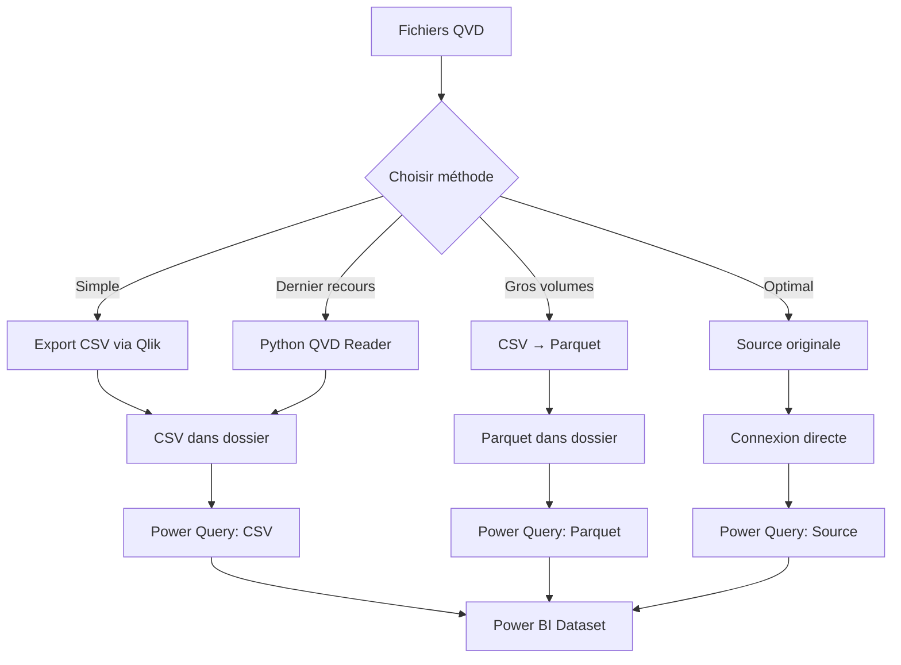

# 📦 Migration des Fichiers QVD vers Power BI

## 📋 Qu'est-ce qu'un Fichier QVD ?

Les fichiers **QVD (QlikView Data)** sont des fichiers de données propriétaires Qlik contenant :
- ✅ Données sous forme de table (lignes et colonnes)
- ✅ Métadonnées (types de colonnes, index)
- ✅ Compression optimisée pour Qlik

**Problème :** Power BI ne peut **PAS** lire les fichiers QVD directement.

---

## 🎯 Solutions de Migration QVD

### 📊 Vue d'Ensemble des Options

| Solution | Complexité | Temps | Qualité | Recommandé |
|----------|------------|-------|---------|------------|
| **1. Export CSV via Qlik** | ⭐ Facile | Rapide | ✅ Parfait | ⭐ **OUI** |
| **2. Export Parquet via Qlik** | ⭐⭐ Moyen | Rapide | ✅ Excellent | Si gros volumes |
| **3. Reconnexion source originale** | ⭐⭐⭐ Complexe | Variable | ✅ Optimal | Si possible |
| **4. QVD Reader Python** | ⭐⭐⭐ Complexe | Moyen | ⚠️ Partiel | Dernier recours |

---

## ✅ SOLUTION 1 : Export CSV via Qlik (RECOMMANDÉ)

### Pourquoi CSV ?

✅ **Universel** - Power BI lit nativement  
✅ **Simple** - Pas de dépendances  
✅ **Fiable** - Format standard  
✅ **Rapide** - Export/Import faciles  

### A. Avec QlikView Desktop

#### Script QlikView pour Export Automatique

```qlik
// Script à exécuter dans QlikView

// 1. Charger le QVD
Products:
LOAD *
FROM [C:\Data\Products.qvd] (qvd);

// 2. Exporter en CSV
STORE Products INTO [C:\Export\Products.csv] (txt);

// Répéter pour chaque table
Orders:
LOAD *
FROM [C:\Data\Orders.qvd] (qvd);

STORE Orders INTO [C:\Export\Orders.csv] (txt);
```

**Exécution :**
1. Créer un nouveau document QlikView (.qvw)
2. Copier le script ci-dessus dans l'éditeur
3. **Recharger** (Ctrl+R)
4. Les CSV sont créés dans `C:\Export\`

#### Export via Interface QlikView

1. **Ouvrir** le document QlikView contenant les QVD
2. **Créer une table** avec toutes les colonnes
3. **Clic droit sur la table** → **Exporter**
4. **Format** : CSV (délimité par des virgules)
5. **Sauvegarder**

### B. Avec Qlik Sense Desktop

#### Méthode 1 : Export Direct

1. **Ouvrir** l'application Qlik Sense
2. **Créer une table** temporaire avec les données du QVD
3. **Clic droit** → **Exporter les données**
4. **Format** : CSV
5. **Télécharger**

#### Méthode 2 : Script Qlik Sense

```qlik
// Dans l'éditeur de script Qlik Sense

// Charger le QVD
TempTable:
LOAD *
FROM [lib://DataFiles/Products.qvd] (qvd);

// Exporter
STORE TempTable INTO [lib://Export/Products.csv] (txt);

DROP TABLE TempTable;
```

### C. Avec Qlik NPrinting (Automatisation)

Pour exporter plusieurs QVD automatiquement :

1. **Créer un rapport NPrinting** Excel/CSV
2. **Configurer les tables** à exporter
3. **Planifier** l'export automatique
4. **Récupérer** les CSV générés

---

## 🚀 SOLUTION 2 : Export Parquet (Pour Gros Volumes)

### Pourquoi Parquet ?

✅ **Compression** - 70-80% plus petit que CSV  
✅ **Performance** - Lecture ultra-rapide dans Power BI  
✅ **Types de données** - Préservation parfaite  

### Script Python pour QVD → Parquet

```python
"""
Convertir QVD en Parquet via export CSV intermédiaire
"""

import pandas as pd
from pathlib import Path

def qvd_to_parquet_via_csv(csv_path: Path, parquet_path: Path):
    """
    Convertir un CSV (exporté depuis QVD) en Parquet.
    
    Args:
        csv_path: Chemin du CSV exporté depuis Qlik
        parquet_path: Chemin du fichier Parquet de sortie
    """
    # Lire le CSV
    print(f"Lecture de {csv_path}...")
    df = pd.read_csv(csv_path, encoding='utf-8-sig')
    
    print(f"  {len(df)} lignes, {len(df.columns)} colonnes")
    
    # Sauvegarder en Parquet
    print(f"Écriture de {parquet_path}...")
    df.to_parquet(parquet_path, engine='pyarrow', compression='snappy')
    
    # Statistiques
    csv_size = csv_path.stat().st_size / (1024 * 1024)  # MB
    parquet_size = parquet_path.stat().st_size / (1024 * 1024)  # MB
    compression_ratio = (1 - parquet_size / csv_size) * 100
    
    print(f"✓ Terminé!")
    print(f"  CSV: {csv_size:.1f} MB")
    print(f"  Parquet: {parquet_size:.1f} MB")
    print(f"  Compression: {compression_ratio:.1f}%")

# Exemple d'utilisation
csv_path = Path("C:/Export/Products.csv")
parquet_path = Path("C:/Export/Products.parquet")

qvd_to_parquet_via_csv(csv_path, parquet_path)
```

### Import Parquet dans Power BI

Power Query M :
```powerquery
let
    Source = Parquet.Document(File.Contents("C:\Export\Products.parquet")),
    Navigation = Source{[Name="Data"]}[Data]
in
    Navigation
```

---

## 🔄 SOLUTION 3 : Reconnexion Source Originale (OPTIMAL)

### Principe

Au lieu d'utiliser les QVD (qui sont des exports), **reconnecter directement** aux sources de données originales.

### Avantages

✅ **Données à jour** - Actualisation automatique  
✅ **Pas d'export** - Pas de fichiers intermédiaires  
✅ **DirectQuery possible** - Pas de limite de taille  
✅ **Optimal** - Architecture moderne  

### Identifier les Sources Originales

#### Dans le Script Qlik

```qlik
// Exemple de script Qlik
Products:
LOAD
    ProductID,
    ProductName,
    Price
FROM [Products.qvd] (qvd);
```

**Question :** D'où vient `Products.qvd` ? Chercher dans le script complet :

```qlik
// Souvent dans un script de chargement initial :
Products:
SQL SELECT 
    ProductID,
    ProductName,
    Price
FROM SQLServer.Database.dbo.Products;

STORE Products INTO [Products.qvd] (qvd);
```

→ **Source originale** : SQL Server

### Reconnexion dans Power BI

Power Query M :
```powerquery
let
    // Au lieu de charger le QVD exporté...
    // Source = Csv.Document(File.Contents("C:\Export\Products.csv"))
    
    // Reconnecter directement à SQL Server
    Source = Sql.Database("NomServeur", "NomBase"),
    Products = Source{[Schema="dbo",Item="Products"]}[Data],
    SelectedColumns = Table.SelectColumns(Products, {"ProductID", "ProductName", "Price"})
in
    SelectedColumns
```

### Mapping des Sources

| Source Qlik | Équivalent Power BI |
|-------------|---------------------|
| SQL Server | `Sql.Database()` |
| Oracle | `Oracle.Database()` |
| MySQL | `MySQL.Database()` |
| PostgreSQL | `PostgreSQL.Database()` |
| Excel | `Excel.Workbook()` |
| CSV | `Csv.Document()` |
| OData | `OData.Feed()` |
| REST API | `Web.Contents()` |

---

## 🛠️ SOLUTION 4 : QVD Reader Python (Avancé)

### Bibliothèques Python pour Lire QVD

#### Option A : qvd (limitée)

```bash
pip install qvd
```

```python
import qvd

# Lire un QVD
df = qvd.read('Products.qvd')

# Exporter en CSV
df.to_csv('Products.csv', index=False)
```

⚠️ **Limites :**
- Support partiel des versions QVD
- Peut échouer sur certains QVD complexes
- Maintenance limitée

#### Option B : pyqvd

```bash
pip install pyqvd
```

```python
from pyqvd import QvdDataFrame

# Lire un QVD
qvd_df = QvdDataFrame.from_qvd('Products.qvd')

# Convertir en Pandas DataFrame
df = qvd_df.to_pandas()

# Exporter
df.to_csv('Products.csv', index=False)
df.to_parquet('Products.parquet')
```

---

## 📋 Workflow Complet de Migration QVD

### Étape par Étape


```mermaid
graph TD
    A[Fichiers QVD] --> B{Choisir méthode}
    B -->|Simple| C[Export CSV via Qlik]
    B -->|Gros volumes| D[CSV → Parquet]
    B -->|Optimal| E[Source originale]
    B -->|Dernier recours| F[Python QVD Reader]
    
    C --> G[CSV dans dossier]
    D --> H[Parquet dans dossier]
    E --> I[Connexion directe]
    F --> G
    
    G --> J[Power Query: CSV]
    H --> K[Power Query: Parquet]
    I --> L[Power Query: Source]
    
    J --> M[Power BI Dataset]
    K --> M
    L --> M
```

### 1. Inventaire des QVD

Créer un fichier `qvd_inventory.csv` :

```csv
QVD_File,Source_Type,Source_Connection,Table_Name,Row_Count
Products.qvd,SQL Server,Server01.db,dbo.Products,10000
Orders.qvd,SQL Server,Server01.db,dbo.Orders,50000
Customers.qvd,Oracle,OracleDB,Customers,5000
```

### 2. Export des QVD

**Script QlikView pour Export Batch :**

```qlik
// export_all_qvd.qvs

// Définir le dossier d'export
SET vExportPath = 'C:\Export\';

// Liste des QVD à exporter
FOR Each vQVD in 'Products', 'Orders', 'Customers'
    
    // Charger le QVD
    $(vQVD):
    LOAD *
    FROM [C:\Data\$(vQVD).qvd] (qvd);
    
    // Exporter en CSV
    STORE $(vQVD) INTO [$(vExportPath)$(vQVD).csv] (txt);
    
    // Nettoyer
    DROP TABLE $(vQVD);
    
NEXT vQVD
```

### 3. Conversion Parquet (Optionnel)

```python
"""
Convertir tous les CSV en Parquet
"""

from pathlib import Path
import pandas as pd

export_dir = Path("C:/Export")

for csv_file in export_dir.glob("*.csv"):
    print(f"Traitement de {csv_file.name}...")
    
    # Lire CSV
    df = pd.read_csv(csv_file)
    
    # Sauvegarder Parquet
    parquet_file = csv_file.with_suffix('.parquet')
    df.to_parquet(parquet_file, compression='snappy')
    
    print(f"  ✓ {parquet_file.name}")
```

### 4. Import dans Power BI

#### A. Créer une Fonction Power Query pour CSV

```powerquery
// Fonction : LoadCSV
(FileName as text) as table =>
let
    Source = Csv.Document(
        File.Contents("C:\Export\" & FileName & ".csv"),
        [Delimiter=",", Encoding=65001]
    ),
    PromotedHeaders = Table.PromoteHeaders(Source, [PromoteAllScalars=true]),
    ChangedTypes = Table.TransformColumnTypes(PromotedHeaders, {
        // Adapter selon vos colonnes
    })
in
    ChangedTypes
```

**Utilisation :**
```powerquery
Products = LoadCSV("Products")
Orders = LoadCSV("Orders")
Customers = LoadCSV("Customers")
```

#### B. Ou Reconnexion Directe

```powerquery
// Connexion SQL Server
let
    Source = Sql.Database("Server01", "Database"),
    Products = Source{[Schema="dbo",Item="Products"]}[Data],
    Orders = Source{[Schema="dbo",Item="Orders"]}[Data],
    Customers = Source{[Schema="dbo",Item="Customers"]}[Data]
in
    Products // ou Orders, Customers
```

---

## 🔧 Script Automatisé de Migration QVD

Créons un script Python complet :

```python
"""
Migration automatisée QVD → Power BI
"""

import pandas as pd
from pathlib import Path
import json
from typing import List, Dict

class QVDMigrator:
    """Migrer les QVD vers des formats Power BI compatibles."""
    
    def __init__(self, qvd_folder: Path, export_folder: Path):
        self.qvd_folder = Path(qvd_folder)
        self.export_folder = Path(export_folder)
        self.export_folder.mkdir(exist_ok=True)
        
    def export_qvd_to_csv_via_qlik(self) -> str:
        """
        Générer un script Qlik pour exporter tous les QVD en CSV.
        
        Returns:
            Script Qlik à exécuter
        """
        qvd_files = list(self.qvd_folder.glob("*.qvd"))
        
        script = f"""
// Script d'export automatique QVD → CSV
// Généré automatiquement

SET vExportPath = '{self.export_folder}\\';
SET vQVDPath = '{self.qvd_folder}\\';

"""
        for qvd in qvd_files:
            table_name = qvd.stem
            script += f"""
// Export de {table_name}
{table_name}:
LOAD *
FROM [$(vQVDPath){qvd.name}] (qvd);

STORE {table_name} INTO [$(vExportPath){table_name}.csv] (txt);
DROP TABLE {table_name};

"""
        
        # Sauvegarder le script
        script_file = self.export_folder / "export_qvd.qvs"
        with open(script_file, 'w', encoding='utf-8') as f:
            f.write(script)
        
        return str(script_file)
    
    def csv_to_parquet_all(self):
        """Convertir tous les CSV en Parquet."""
        csv_files = list(self.export_folder.glob("*.csv"))
        
        results = []
        for csv_file in csv_files:
            print(f"Conversion: {csv_file.name}")
            
            df = pd.read_csv(csv_file, encoding='utf-8-sig')
            parquet_file = csv_file.with_suffix('.parquet')
            df.to_parquet(parquet_file, compression='snappy')
            
            results.append({
                'table': csv_file.stem,
                'csv_size_mb': csv_file.stat().st_size / (1024**2),
                'parquet_size_mb': parquet_file.stat().st_size / (1024**2),
                'rows': len(df),
                'columns': len(df.columns)
            })
            
            print(f"  ✓ {parquet_file.name}")
        
        # Sauvegarder rapport
        report_file = self.export_folder / "migration_report.json"
        with open(report_file, 'w') as f:
            json.dump(results, f, indent=2)
        
        return results
    
    def generate_powerquery_script(self, use_parquet: bool = False) -> str:
        """
        Générer un script Power Query pour charger toutes les tables.
        
        Args:
            use_parquet: Utiliser Parquet au lieu de CSV
        """
        ext = '.parquet' if use_parquet else '.csv'
        files = list(self.export_folder.glob(f"*{ext}"))
        
        script = f"""
// Script Power Query généré automatiquement
// Chemin des données : {self.export_folder}

let
"""
        
        for file in files:
            table_name = file.stem
            
            if use_parquet:
                script += f"""
    {table_name} = let
        Source = Parquet.Document(File.Contents("{file}")),
        Data = Source{{[Name="Data"]}}[Data]
    in Data,
"""
            else:
                script += f"""
    {table_name} = let
        Source = Csv.Document(File.Contents("{file}"), 
            [Delimiter=",", Encoding=65001]),
        Headers = Table.PromoteHeaders(Source)
    in Headers,
"""
        
        script += f"""
    
    // Retourner la première table (modifier selon besoin)
    Result = {files[0].stem}
in
    Result
"""
        
        # Sauvegarder
        script_file = self.export_folder / "load_data.pq"
        with open(script_file, 'w', encoding='utf-8') as f:
            f.write(script)
        
        return script

# Utilisation
migrator = QVDMigrator(
    qvd_folder="C:/QlikData/QVD",
    export_folder="C:/Export/PowerBI"
)

# 1. Générer script Qlik pour export
qlik_script = migrator.export_qvd_to_csv_via_qlik()
print(f"Script Qlik généré : {qlik_script}")
print("Exécutez ce script dans QlikView/Qlik Sense")

# 2. Après exécution du script Qlik, convertir en Parquet
input("Appuyez sur Entrée après avoir exécuté le script Qlik...")
results = migrator.csv_to_parquet_all()

# 3. Générer script Power Query
pq_script = migrator.generate_powerquery_script(use_parquet=True)
print(f"\nScript Power Query : {pq_script}")
```

---

## 📊 Tableau de Décision

### Quelle Solution Choisir ?

| Critère | CSV | Parquet | Source Originale |
|---------|-----|---------|------------------|
| **Simplicité** | ⭐⭐⭐ | ⭐⭐ | ⭐ |
| **Performance** | ⭐⭐ | ⭐⭐⭐ | ⭐⭐⭐ |
| **Actualisation données** | ❌ Manuelle | ❌ Manuelle | ✅ Automatique |
| **Taille fichiers** | ❌ Grande | ✅ Petite | ➖ N/A |
| **Compatibilité** | ✅ Universelle | ✅ Excellente | ⚠️ Dépend source |
| **DirectQuery** | ❌ Non | ❌ Non | ✅ Oui (SQL) |

**Recommandation :**
- **Petits volumes (<100 MB)** → CSV
- **Gros volumes (>100 MB)** → Parquet
- **Données temps réel** → Source originale
- **Migration ponctuelle** → CSV (plus simple)

---

## ✅ Checklist Migration QVD

- [ ] Inventaire de tous les QVD
- [ ] Identification des sources originales (si possible)
- [ ] Choix de la stratégie (CSV/Parquet/Source)
- [ ] Export des QVD via Qlik (si CSV/Parquet)
- [ ] Conversion Parquet (si gros volumes)
- [ ] Création scripts Power Query
- [ ] Test de chargement dans Power BI
- [ ] Vérification des types de données
- [ ] Validation des volumes (nombre de lignes)
- [ ] Documentation des transformations

---

## 🆘 Dépannage

### Problème : QVD trop volumineux

**Solution :**
- Utiliser Parquet (compression ~70%)
- Ou filtrer les données avant export
- Ou utiliser DirectQuery vers source originale

### Problème : Encoding bizarre dans CSV

**Solution :**
```powerquery
// Spécifier UTF-8 avec BOM
Source = Csv.Document(
    File.Contents("fichier.csv"),
    [Delimiter=",", Encoding=65001]  // UTF-8
)
```

### Problème : Types de données incorrects

**Solution :**
```powerquery
// Forcer les types
ChangedTypes = Table.TransformColumnTypes(Source, {
    {"Date", type date},
    {"Amount", type number},
    {"Category", type text}
})
```

---

**📚 Voir aussi :**
- [QUICK_START_HYBRIDE.md](QUICK_START_HYBRIDE.md) - Migration complète Qlik → Power BI
- [MIGRATION_HYBRIDE_GUIDE.md](MIGRATION_HYBRIDE_GUIDE.md) - Guide détaillé
